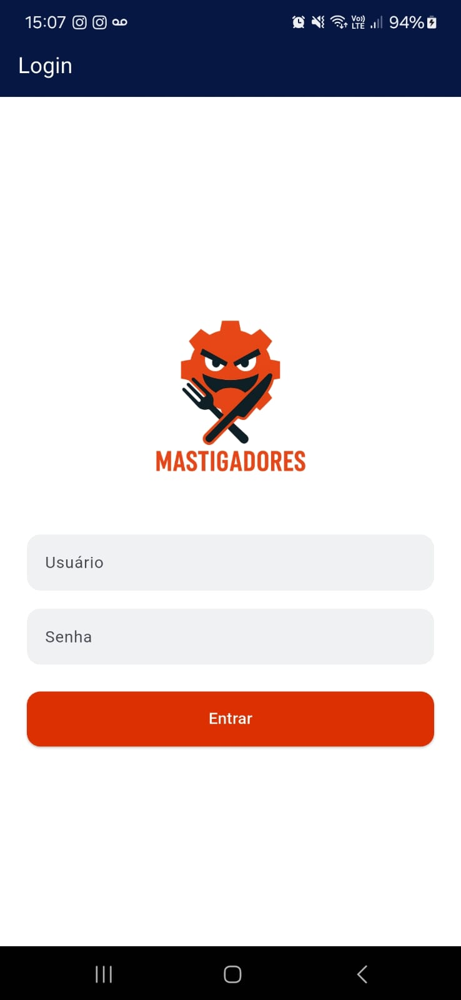
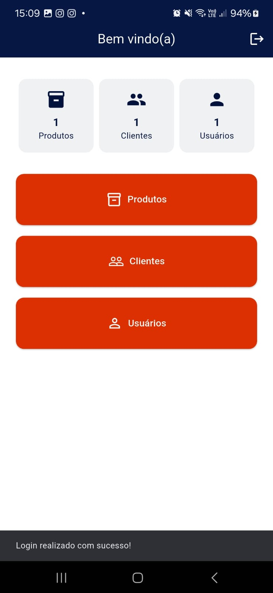
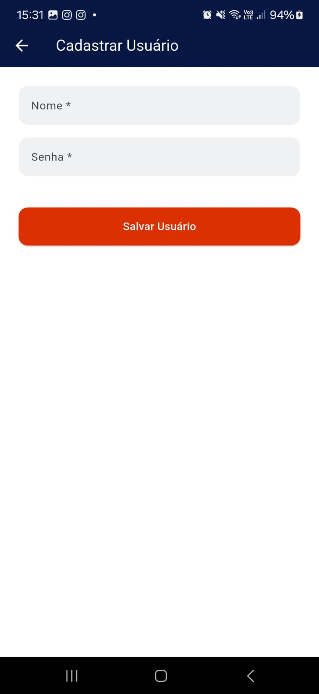
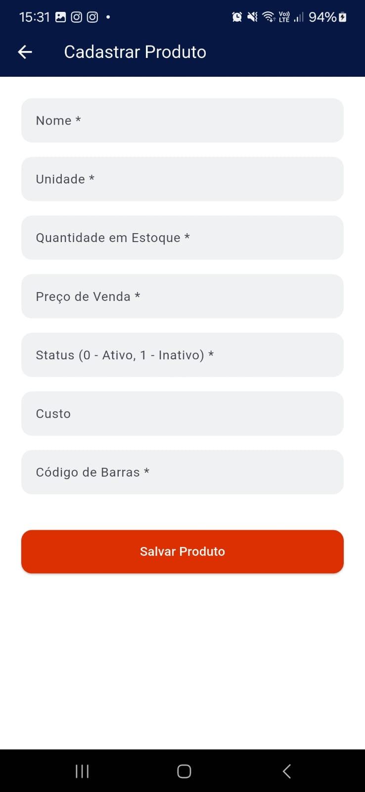
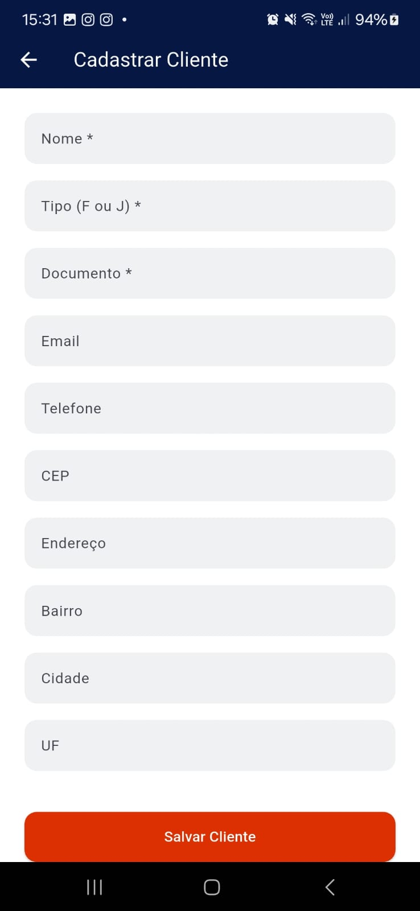

# Mastigadores Vendas

Aplicativo desenvolvido como atividade para a matéria de **Aplicativos Mobile** na faculdade **UCL**.

## Integrantes do Grupo
- Guilherme Kunsch
- João Victor Sarmento

## Tecnologias Utilizadas
- **Flutter**: Framework de UI para desenvolvimento de aplicativos móveis.
- **Dart**: Linguagem de programação utilizada no desenvolvimento do Flutter.
- **Material Design**: Interface moderna, intuitiva e adaptável, utilizada para criar a experiência visual do aplicativo.
- **Shared Preferences**: Biblioteca para persistência simples de dados no dispositivo.
- **Path Provider**: Biblioteca para localizar diretórios em dispositivos móveis para salvar arquivos de forma segura.

## Funcionalidades
- Cadastro de usuários, clientes e produtos com CRUD completo.
- Tela de login com acesso padrão 'admin/admin' caso não haja usuário cadastrado.
- Listagem de produtos com opções para adicionar, editar e excluir.
- Armazenamento local em arquivos JSON.

## Como Rodar o Projeto
- git clone https://github.com/seu_usuario/mastigadores_vendas.git
- flutter run

## Imagens






### Pré-requisitos
- Ter o [Flutter SDK](https://flutter.dev/docs/get-started/install) instalado.
- Em um terminal, rodar o seguinte comando para verificar se o Flutter está corretamente instalado:

```bash
flutter doctor
